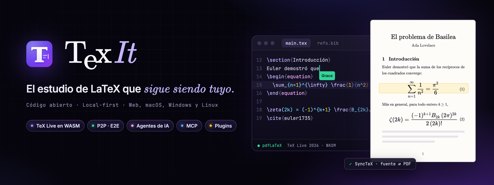
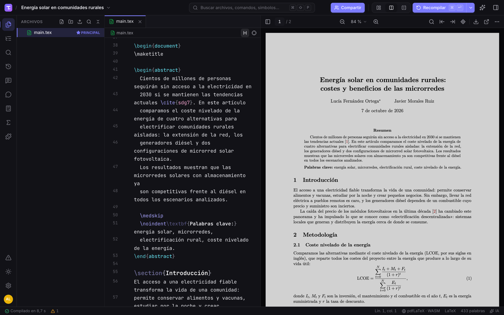
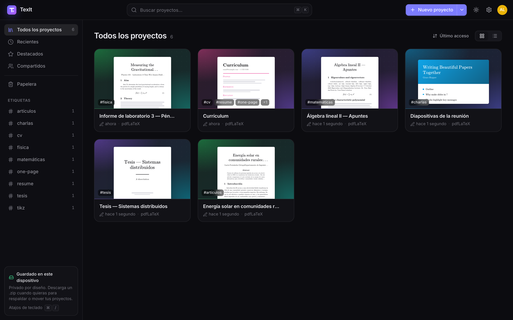
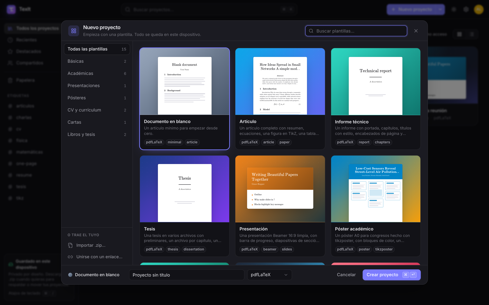
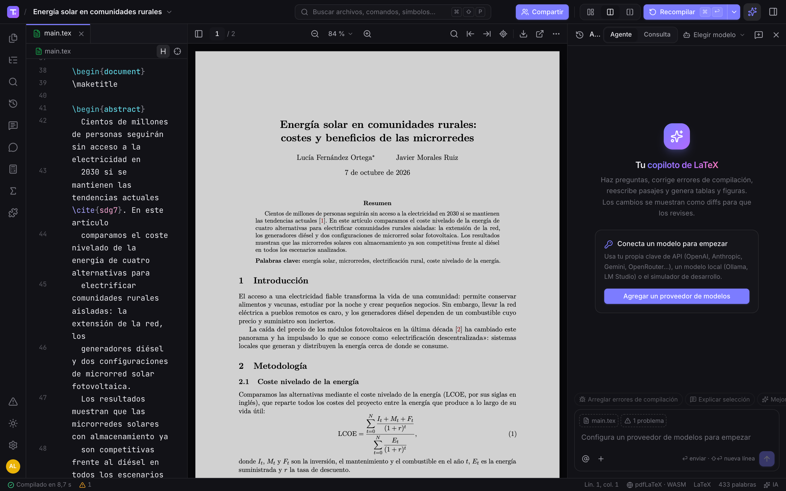
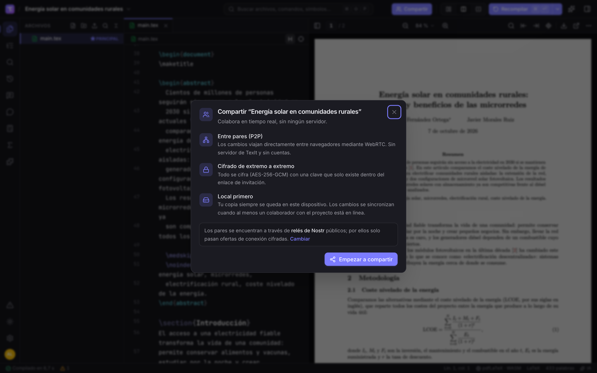
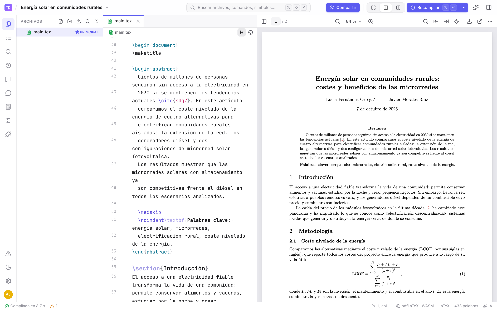
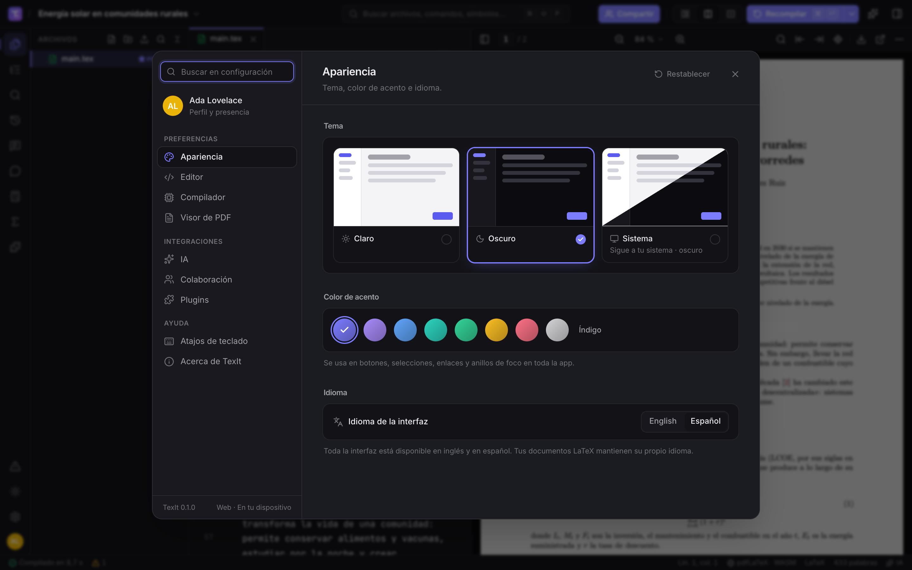

<p align="right"><a href="README.md">English</a> · <b>Español</b></p>

<p align="center">
  
</p>

<p align="center">
  <b>Escribe LaTeX en el navegador o en tu escritorio, compílalo en tu propia computadora, colabora en tiempo real sin servidor<br>
  y usa la IA por la que ya pagas — una alternativa libre y gratuita a Overleaf y Texifier<br>
  donde tus proyectos viven en tu dispositivo, no en la nube de otro.</b>
</p>

<p align="center">
  
  <a href="https://github.com/fernandevdaza/texit/actions/workflows/ci.yml"></a>
  
  
  
  
  <br>
  
  
  
  
  
  <a href="LICENSE"></a>
</p>

<p align="center">
  <a href="https://fernandevdaza.github.io/texit/"><b>🌐 Abrir la app</b></a> ·
  <a href="https://github.com/fernandevdaza/texit/releases"><b>⬇️ Descargar para escritorio</b></a> ·
  <a href="docs/architecture.md"><b>📖 Documentación</b></a> ·
  <a href="docs/plugins.md"><b>🧩 Plugins</b></a> ·
  <a href="#-desarrollo"><b>🛠️ Desarrollo</b></a>
</p>

<div align="center">

| **TeX Live 2026** | **3 motores** | **P2P** | **IA** | **Cualquier SO** |
|:---:|:---:|:---:|:---:|:---:|
| compilado a WebAssembly, en tu navegador | pdfLaTeX · XeLaTeX · LuaLaTeX + BibTeX/Biber | en tiempo real, cifrado de extremo a extremo, sin servidor | tus claves, modelos locales o tu suscripción | web · macOS · Windows · Linux |

</div>

> **Tus proyectos nunca salen de tu computadora.** Los archivos viven en el almacenamiento de tu navegador (o en carpetas
> de tu disco en la app de escritorio) y se compilan localmente. Sin cuenta, sin servidor de TexIt, sin rastreo. Cuando
> compartes un proyecto, los cambios viajan directamente entre colaboradores, cifrados con una clave que solo existe en el
> enlace de invitación. La IA está apagada hasta que conectas un proveedor — y puede ser un modelo que corre en tu propia
> máquina.

---

## ✨ Funciones

- **Un TeX Live de verdad, en el navegador.** TeX Live 2026 compilado a WebAssembly
  ([BusyTeX](https://github.com/TeXlyre/texlyre-busytex)) ejecuta pdfLaTeX, XeLaTeX y LuaLaTeX, además de BibTeX, Biber y
  makeindex, en un Web Worker. Los conjuntos de paquetes se eligen según lo que usa tu proyecto y quedan en la caché del
  navegador, así que sigue funcionando sin conexión. En escritorio, TexIt puede usar tu TeX Live / MiKTeX / MacTeX nativo
  (`latexmk`) o Tectonic, y cualquiera puede alojar el pequeño [servidor de compilación](apps/compile-server).
- **Un editor que entiende LaTeX.** CodeMirror 6 con autocompletado de 528 comandos, 99 entornos y 350 símbolos
  matemáticos, además de `\ref`, `\cite`, archivos y paquetes de tu proyecto; snippets, vista previa de fórmulas con KaTeX
  al pasar el ratón, análisis de errores en vivo, plegado, esquema del documento, buscar y reemplazar en todo el
  proyecto, atajos de Vim/Emacs y decoraciones de texto enriquecido.
- **Visor de PDF con SyncTeX en ambos sentidos.** Visor pdf.js que recompila sin parpadeos: doble clic en el PDF para
  saltar al código, o salta del cursor al PDF. Los errores y advertencias se extraen del log y se enlazan con el código.
- **Colaboración en tiempo real sin servidor.** Los proyectos son CRDT de [Yjs](https://yjs.dev) sincronizados por WebRTC
  (señalización con [Trystero](https://github.com/dmotz/trystero) a través de relés públicos Nostr, BitTorrent o MQTT),
  cifrados de extremo a extremo con AES-256-GCM. Cursores en vivo, chat, comentarios de revisión, modo seguir e
  invitaciones de solo lectura garantizadas con firmas Ed25519.
- **Copiloto y agentes de IA — con tus modelos.** Un agente de chat que lee, edita y compila tu proyecto, mostrando
  cada cambio como un diff para revisar. Ediciones en línea con <kbd>⌘K</kbd>, autocompletado fantasma, «corregir errores de
  compilación» y «explicar selección». Usa tu propia clave, modelos locales o tu suscripción de ChatGPT / Claude / Gemini
  en escritorio. [Más ↓](#-ia-y-mcp)
- **MCP en ambos sentidos.** Conecta servidores MCP (HTTP/SSE, y stdio en escritorio) como herramientas del agente — y
  expón TexIt como servidor MCP para que Claude Code, Codex o Cursor trabajen sobre el proyecto abierto.
- **Plugins.** Una API de plugins pequeña y tipada (`@texit/plugin-api`, MIT): comandos, paneles, elementos de la barra
  de estado, snippets, autocompletado, motores de compilación, herramientas de IA y plantillas. Siete plugins incluidos:
  contador de palabras, paleta de símbolos, generador de tablas, herramientas BibTeX (búsqueda por DOI / arXiv / ISBN),
  snippets, lorem ipsum y modo zen. [Más ↓](#-plugins)
- **Proyectos, archivos e historial.** Gestor de archivos con arrastrar y soltar y subida de carpetas, importación y
  exportación `.zip` compatible con Overleaf, vista previa de imágenes y PDF, historial de versiones con diffs y
  restauración en un clic, y 15 plantillas (artículo, informe, tesis, beamer, póster, CV, carta, libro, tarea, informe de
  laboratorio, artículo IEEE, apuntes de matemáticas, artículo en español…).
- **Agradable de usar.** Interfaz en español e inglés, temas claro y oscuro, colores de acento, paleta de comandos para
  todo (<kbd>⌘⇧P</kbd>), apertura rápida (<kbd>⌘P</kbd>) y los atajos de teclado que ya conoces.

## 📸 Capturas

<table>
  <tr>
    <td colspan="2"><p align="center"><sub><b>Espacio de trabajo</b> · el código LaTeX junto al PDF compilado en el navegador, con SyncTeX</sub></p></td>
  </tr>
  <tr>
    <td width="50%"><p align="center"><sub><b>Panel</b> · proyectos locales con miniaturas y etiquetas</sub></p></td>
    <td width="50%"><p align="center"><sub><b>Nuevo proyecto</b> · 15 plantillas, de artículos a beamer y pósteres</sub></p></td>
  </tr>
  <tr>
    <td><p align="center"><sub><b>Copiloto de IA</b> · modos agente y preguntar, con tu propio proveedor</sub></p></td>
    <td><p align="center"><sub><b>Compartir</b> · entre pares y cifrado de extremo a extremo</sub></p></td>
  </tr>
  <tr>
    <td><p align="center"><sub><b>Tema claro</b> · y ocho colores de acento</sub></p></td>
    <td><p align="center"><sub><b>Configuración</b> · tema, color de acento e idioma — y editor, compilador, PDF, IA y plugins</sub></p></td>
  </tr>
</table>

## 🚀 Inicio rápido

1. Abre **[la app](https://fernandevdaza.github.io/texit/)** — nada que instalar, sin cuenta.
2. **Nuevo proyecto** → elige una plantilla (o **Importar .zip** para traer un proyecto de Overleaf).
3. Pulsa <kbd>⌘↩</kbd> / <kbd>Ctrl+Enter</kbd> para compilar.

> [!NOTE]
> La **primera compilación descarga TeX Live** en tu navegador: unos 120 MB para un documento típico, y más (hasta
> ~500 MB) solo si tu proyecto necesita los conjuntos de paquetes grandes. Se descarga una vez y queda en caché — las
> siguientes compilaciones empiezan al instante y funcionan sin conexión. Los proyectos se guardan en tu navegador; usa
> **Exportar .zip** (o la app de escritorio) para tener copias de seguridad.

## ⬇️ App de escritorio

¿Prefieres una app normal con carpetas reales en tu disco? Los instaladores para **macOS, Windows y Linux** están en la
página de **[Releases](https://github.com/fernandevdaza/texit/releases)**:

| Sistema | Archivo |
|---|---|
| macOS (Apple Silicon / Intel) | `TexIt-x.y.z-mac-arm64.dmg` · `TexIt-x.y.z-mac-x64.dmg` (y `.zip`) |
| Windows (x64 / ARM64) | `TexIt-x.y.z-win.exe` (x64 + ARM64) · `TexIt-x.y.z-portable.exe` |
| Linux (x64) | `TexIt-x.y.z-linux-x86_64.AppImage` · `…-linux-amd64.deb` · `…-linux-x86_64.rpm` |

> [!NOTE]
> Las apps aún no están firmadas con un certificado de pago (en macOS llevan una firma ad-hoc). **macOS:** si dice que
> no puede verificar al desarrollador, abre *Ajustes del Sistema → Privacidad y seguridad* y pulsa **Abrir igualmente**
> (o ejecuta `xattr -cr /Applications/TexIt.app`). **Windows:** si aparece SmartScreen, pulsa *Más información* →
> *Ejecutar de todas formas*.

La app de escritorio es la misma que la versión web, y además: proyectos como **carpetas en disco** (sincronizadas en
ambos sentidos mientras están abiertas), **TeX nativo** (TeX Live / MiKTeX / MacTeX mediante `latexmk`, o Tectonic —
instala uno de ellos; el TeX Live del navegador no se incluye para que la descarga sea pequeña), claves de IA en el
**llavero del sistema**, **CLI de suscripción** (Codex CLI, Claude Code, Gemini CLI), **servidores MCP stdio**, TexIt como
**servidor MCP**, asociación de archivos `.tex` y menús nativos. Cada push compila los instaladores en GitHub Actions
([flujo Desktop apps](https://github.com/fernandevdaza/texit/actions/workflows/desktop.yml) → *Artifacts*).

## 🔁 ¿Vienes de Overleaf?

| Overleaf | TexIt |
|---|---|
| Menú → Download → Source (`.zip`) | Panel → **Importar .zip** — se detectan archivos, carpetas, documento principal y motor |
| Recompile (<kbd>⌘↩</kbd>), guardar y compilar (<kbd>⌘S</kbd>) | Los mismos atajos — y además compilación automática mientras escribes |
| Compilador: pdfLaTeX / XeLaTeX / LuaLaTeX | Los mismos motores, con BibTeX o Biber y makeindex |
| <kbd>⌘B</kbd> / <kbd>⌘I</kbd> negrita / cursiva, <kbd>⌘/</kbd> comentar, <kbd>⌘F</kbd> buscar | Los mismos atajos |
| Doble clic en el PDF para ir al código | Igual (SyncTeX), y <kbd>⌘⌥J</kbd> del código al PDF |
| Share → invitar colaboradores | **Compartir** → envía el enlace de invitación (edición o solo lectura); sin cuentas |
| Review → comentarios, chat | Comentarios de revisión y chat del proyecto, cursores en vivo y modo seguir |
| History | Historial de versiones con diffs, versiones con nombre (<kbd>⌘⌥S</kbd>) y restauración |
| Galería de plantillas | **Nuevo proyecto** → 15 plantillas incluidas (los plugins pueden añadir más) |

Lo que cambia: no hay un servidor central, así que los colaboradores se sincronizan mientras al menos uno de ellos tenga
el proyecto abierto (cada uno conserva una copia local completa), y no hay un panel de proyectos en la nube — tu panel
es tu dispositivo.

## 🤖 IA y MCP

El panel de IA (<kbd>⌘L</kbd> o el botón ✨) tiene un modo **Agente** que puede listar, leer, editar y crear archivos, buscar en
el proyecto, compilar y leer los diagnósticos — cada edición se muestra como un diff que aceptas o rechazas — y un modo
**Preguntar** para consultas. Úsalo con:

| Tipo | Proveedores |
|---|---|
| **Tu clave de API** | OpenAI, Anthropic, Google Gemini, OpenRouter, Groq, DeepSeek, Mistral, xAI, cualquier endpoint compatible con OpenAI |
| **Modelos locales** | Ollama, LM Studio (y llama.cpp, vLLM… mediante la opción compatible con OpenAI) |
| **Tu suscripción** (escritorio) | ChatGPT con **Codex CLI**, Claude con **Claude Code**, Gemini con **Gemini CLI** — TexIt ejecuta la CLI en segundo plano sobre una copia de tu proyecto y sincroniza sus cambios |

Las claves se quedan en tu dispositivo (en el llavero del sistema en escritorio) y las peticiones van directamente de tu
dispositivo al proveedor que elegiste.

**Cliente MCP.** Añade servidores MCP en *Configuración → IA → Servidores MCP* (Streamable HTTP / SSE en todas partes,
stdio en escritorio); sus herramientas quedan disponibles para el agente.

**TexIt como servidor MCP** (escritorio). Actívalo en *Configuración → IA → TexIt como servidor MCP* — escucha en
`127.0.0.1` con un token bearer, y la página de configuración te da fragmentos listos para pegar en cada cliente. Para
Claude Code:

```bash
claude mcp add --transport http texit http://127.0.0.1:4317/mcp --header "Authorization: Bearer <token>"
```

Codex (`~/.codex/config.toml`) y Cursor / otros clientes (JSON `mcpServers`) funcionan igual. El agente externo obtiene
las mismas herramientas de proyecto que el agente de TexIt, sobre el proyecto abierto en la app.

## 🧩 Plugins

Los plugins son módulos ES normales que hablan con TexIt a través de la [`PluginAPI`](packages/plugin-api/src/index.ts)
tipada:

```js
// hello.js — no necesita compilación
const { definePlugin } = window.TexIt;

export default definePlugin({
  id: 'com.example.hello',
  name: 'Hello',
  version: '1.0.0',
  apiVersion: '1.1.0',
  permissions: ['editor'],
  activate(api) {
    api.commands.register({
      id: 'say',
      title: 'Saludar',
      keybinding: 'Mod-Alt-h',
      run: () => api.editor.insertText('¡Hola, mundo!'),
    });
  },
});
```

Instálalo desde *Plugins → + → Instalar desde URL…*. La [guía de plugins](docs/plugins.md) (en inglés) explica permisos,
paneles, motores de compilación, herramientas de IA, plantillas, el modo desarrollador (recarga en caliente) y cómo
publicar en un registro. Los siete plugins incluidos en [`apps/web/src/plugins/builtin`](apps/web/src/plugins/builtin)
solo usan la API pública, así que sirven de ejemplo.

> [!WARNING]
> Los permisos son un mecanismo de consentimiento, no un sandbox: los plugins se ejecutan dentro de la app con los
> privilegios de la página. Instala solo plugins en los que confíes.

## 🛠️ Desarrollo

Requisitos: [Node.js](https://nodejs.org) 22 o superior y [pnpm](https://pnpm.io) (`corepack enable`).

```bash
pnpm install
pnpm assets:busytex   # una vez: descarga el paquete TeX Live WASM (~520 MB) en apps/web/public/busytex
pnpm dev              # app web en http://localhost:5173
pnpm desktop:dev      # servidor de desarrollo + Electron
pnpm test             # 357 pruebas unitarias (Vitest + node:test)
pnpm typecheck
pnpm build            # build web estático en apps/web/dist (TEXIT_BASE=/texit/ para una subruta)
pnpm desktop:dist     # instaladores para la plataforma actual
pnpm screenshots      # banners y capturas del README (requiere Google Chrome; ONLY=banner|app)
```

| Carpeta | Contenido |
|---|---|
| `apps/web` | SPA con React 19 + Vite — la app web **y** la interfaz de escritorio (`src/features/*`, plugins incluidos) |
| `apps/desktop` | Proceso principal/preload de Electron: TeX nativo, sincronización de carpetas, agentes CLI, MCP stdio + servidor, llavero, menús |
| `apps/compile-server` | Servidor de compilación opcional, sin dependencias y autoalojable (latexmk / tectonic, Docker) |
| `packages/core` | Modelo de proyecto (Yjs), análisis de LaTeX y datos de autocompletado, parser de logs, SyncTeX, zip, plantillas |
| `packages/compiler` | Motores de compilación (BusyTeX WASM, nativo, remoto) y orquestación |
| `packages/ai` | Proveedores, bucle del agente, herramientas de proyecto, ediciones en línea, agentes CLI, cliente/servidor MCP |
| `packages/plugin-api` | API pública de plugins (MIT) |
| `docs` | [Arquitectura](docs/architecture.md) y [guía de plugins](docs/plugins.md) (en inglés) |
| `scripts` | Descarga de los recursos de BusyTeX, imágenes del README |

Cada push a `main` ejecuta la CI y publica la app web en GitHub Pages; las etiquetas `vX.Y.Z` adjuntan los instaladores
de escritorio a un release en borrador.

## 🤝 Contribuir

Las contribuciones son bienvenidas — reportes de errores con un proyecto `.tex` mínimo, plantillas, plugins, traducciones
y documentación. Issues y pull requests en español o inglés. Lee [CONTRIBUTING.es.md](CONTRIBUTING.es.md), el
[Código de conducta](CODE_OF_CONDUCT.md) y la [política de seguridad](SECURITY.md).

## 🙏 Créditos

TexIt se apoya en [TeX Live](https://tug.org/texlive/),
[BusyTeX](https://github.com/busytex/busytex) y [TeXlyre BusyTeX](https://github.com/TeXlyre/texlyre-busytex) (AGPL-3.0),
[pdf.js](https://mozilla.github.io/pdf.js/), [CodeMirror](https://codemirror.net), [Yjs](https://yjs.dev),
[Trystero](https://github.com/dmotz/trystero), [KaTeX](https://katex.org), el [Vercel AI SDK](https://ai-sdk.dev),
el [SDK de Model Context Protocol](https://modelcontextprotocol.io), [Electron](https://www.electronjs.org),
[React](https://react.dev), [Vite](https://vite.dev), [Tailwind CSS](https://tailwindcss.com) y
[Radix UI](https://www.radix-ui.com).

## 📄 Licencia

[AGPL-3.0-or-later](LICENSE) © 2026 Fernando Daza y colaboradores — TexIt incluye TeXlyre BusyTeX (AGPL-3.0). El paquete
de la API de plugins ([`packages/plugin-api`](packages/plugin-api)) es MIT, así que los plugins pueden usar cualquier
licencia.

<sub>Overleaf y Texifier son marcas registradas de sus respectivos dueños. TexIt es un proyecto independiente y no está
afiliado a ellos ni cuenta con su respaldo.</sub>
