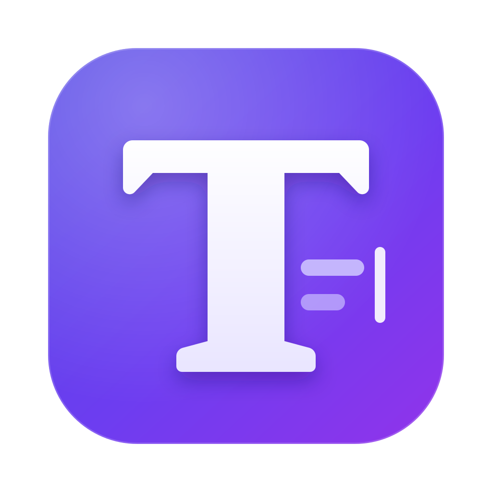

<div align="center">



# TexIt

**The open-source, local-first LaTeX studio.**
Real-time collaboration without servers · AI agents with *your* models · Plugins · Web, macOS, Windows & Linux

</div>

---

TexIt is a free alternative to Overleaf and Texifier. Your projects live on your device (IndexedDB in the browser, or folders on disk in the desktop app), compile **entirely in the browser** with a full TeX Live 2026 compiled to WebAssembly (or with your native TeX installation on desktop), and can be shared peer-to-peer with end-to-end encryption — no accounts, no servers.

## Highlights

| | |
|---|---|
| ✍️ **Editor** | CodeMirror 6 with LaTeX-aware completion (commands, environments, `\ref`, `\cite`, files, packages), snippets, KaTeX math preview on hover, live linting, folding, Vim/Emacs keymaps, rich-text decorations. |
| 📄 **Compile anywhere** | pdfLaTeX, XeLaTeX and LuaLaTeX + BibTeX/Biber/makeindex **in the browser** (BusyTeX/TeX Live 2026 WASM), native TeX Live / MiKTeX / Tectonic on desktop, or a self-hosted compile server. |
| 🔁 **SyncTeX** | Double-click the PDF to jump to the source, jump from source to PDF; no-flicker recompiles. |
| 👥 **Serverless collaboration** | Yjs CRDTs over WebRTC (Trystero signaling via public relays), end-to-end encrypted, live cursors, chat and review comments. |
| 🤖 **AI agents** | Chat agent that reads, edits and compiles your project; inline edits and ghost-text completions. Bring your own API key (OpenAI, Anthropic, Gemini, OpenRouter, Groq, DeepSeek, Mistral, xAI…), run **local models** (Ollama, LM Studio, llama.cpp) or use your **ChatGPT / Claude / Gemini subscription** through Codex CLI, Claude Code or Gemini CLI on desktop. |
| 🔌 **MCP** | Connect MCP servers as agent tools — and expose TexIt itself as an MCP server so Claude Code, Codex, Cursor… can work on the open project. |
| 🧩 **Plugins** | A small, typed Plugin API (`@texit/plugin-api`, MIT): commands, panels, status items, snippets, completions, compile backends, AI tools, templates. |
| 🗂️ **Files** | File manager with drag & drop, folder uploads, `.zip` import/export (Overleaf-compatible), image and PDF preview, version history with diffs and restore. |

## Quick start

```bash
pnpm install
pnpm assets:busytex   # one-time: downloads the TeX Live WASM bundle (~500 MB) into apps/web/public/busytex
pnpm dev              # http://localhost:5173
```

Desktop app (Electron):

```bash
pnpm desktop:dev      # web dev server + Electron
pnpm desktop:dist     # installers for the current platform (dmg/zip, nsis, AppImage/deb/rpm)
```

## Repository layout

```
apps/
  web/             React 19 + Vite SPA (also the desktop renderer)
  desktop/         Electron main/preload: native TeX, CLI agents, MCP server/stdio, folder sync
  compile-server/  Optional self-hostable compile server (Docker)
packages/
  core/            Project model (Yjs), LaTeX analysis, log parser, SyncTeX, zip, templates
  compiler/        Compile backends (BusyTeX WASM, native, remote) + orchestration
  ai/              Providers, agent loop, project tools, CLI agents, MCP client
  plugin-api/      Public plugin API (MIT)
docs/              Architecture, plugins guide
```

See [docs/architecture.md](docs/architecture.md) for the design and [docs/plugins.md](docs/plugins.md) to write plugins.

## License

TexIt is licensed under the **GNU AGPL-3.0-or-later** (it embeds TeXlyre-BusyTeX, AGPL-3.0). The plugin API package (`packages/plugin-api`) is MIT so plugins can use any license.
