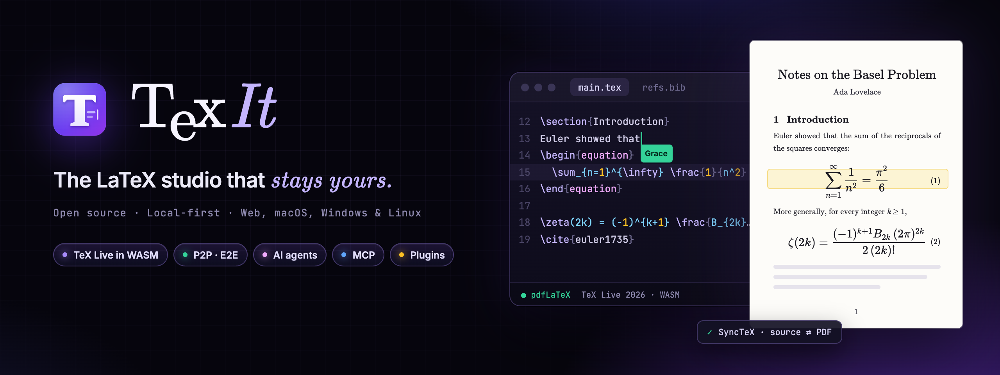
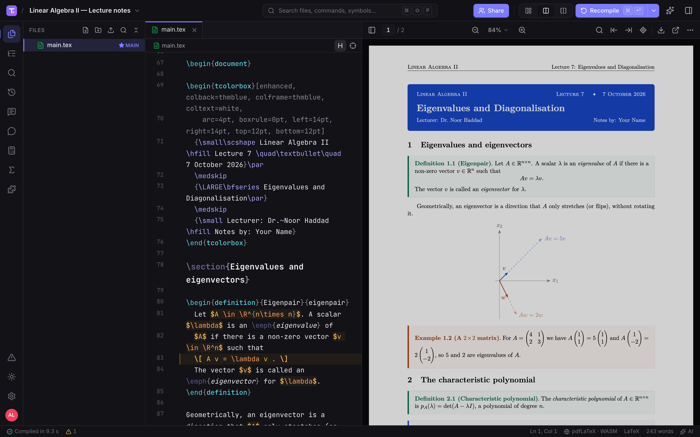
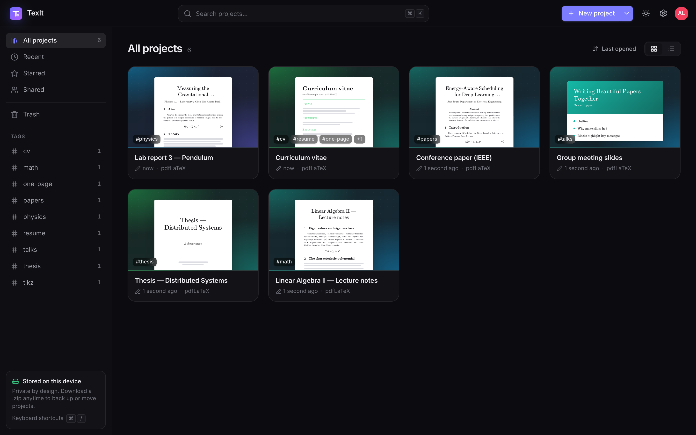
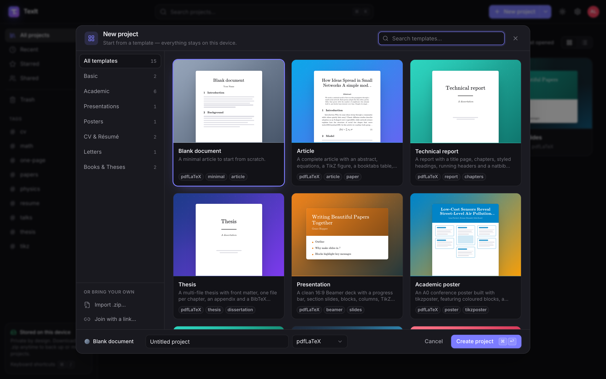
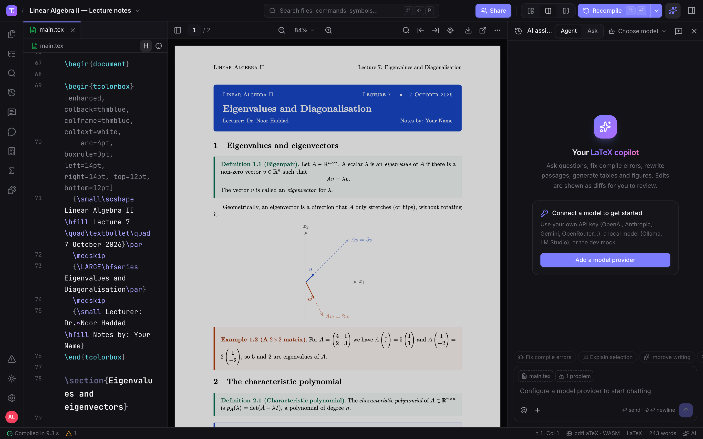
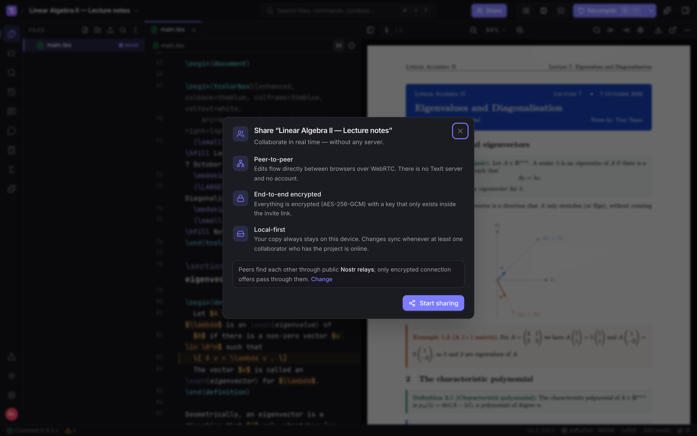
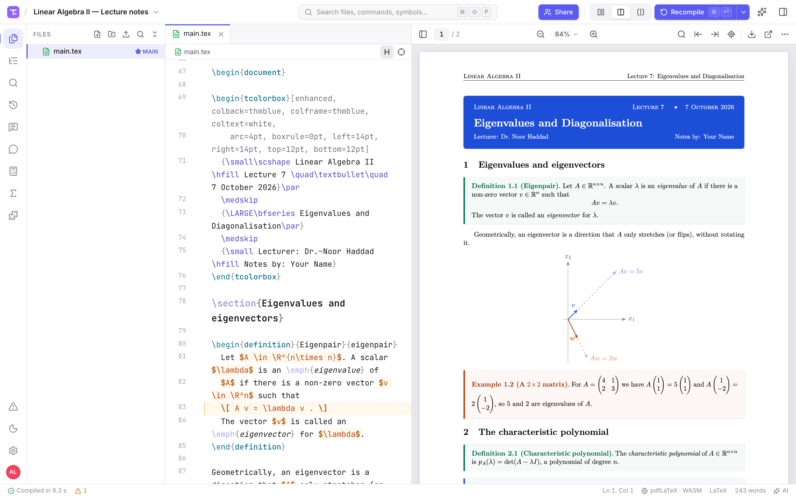
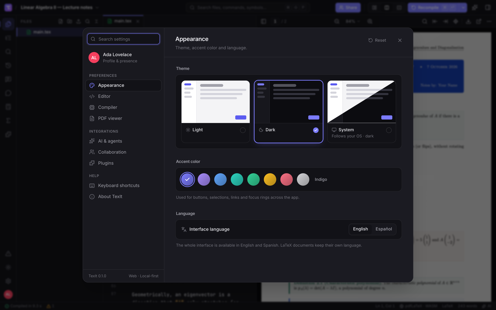

<p align="right"><b>English</b> · <a href="README.es.md">Español</a></p>

<p align="center">
  
</p>

<p align="center">
  <b>Write LaTeX in your browser or on your desktop, compile it on your own machine, collaborate in real time without a server<br>
  and bring the AI you already pay for — a free, open-source alternative to Overleaf and Texifier<br>
  where your projects live on your device, not in someone else's cloud.</b>
</p>

<p align="center">
  
  <a href="https://github.com/fernandevdaza/texit/actions/workflows/ci.yml"></a>
  
  
  
  
  <br>
  
  
  
  
  
  <a href="LICENSE"></a>
</p>

<p align="center">
  <a href="https://fernandevdaza.github.io/texit/"><b>🌐 Open the app</b></a> ·
  <a href="https://github.com/fernandevdaza/texit/releases"><b>⬇️ Download for desktop</b></a> ·
  <a href="docs/architecture.md"><b>📖 Docs</b></a> ·
  <a href="docs/plugins.md"><b>🧩 Plugins</b></a> ·
  <a href="#-development"><b>🛠️ Develop</b></a>
</p>

<div align="center">

| **TeX Live 2026** | **3 engines** | **P2P** | **AI** | **Any OS** |
|:---:|:---:|:---:|:---:|:---:|
| compiled to WebAssembly, in your browser | pdfLaTeX · XeLaTeX · LuaLaTeX + BibTeX/Biber | real-time, end-to-end encrypted, no server | your keys, local models or your subscription | web · macOS · Windows · Linux |

</div>

> **Your projects never leave your computer.** Files live in your browser's storage (or in folders on disk in the
> desktop app) and compile locally. No account, no TexIt server, no tracking. When you share a project, edits travel
> directly between collaborators, encrypted with a key that only exists in the invite link. AI is off until you connect
> a provider — and it can be a model running on your own machine.

---

## ✨ Features

- **A real TeX Live, in the browser.** TeX Live 2026 compiled to WebAssembly ([BusyTeX](https://github.com/TeXlyre/texlyre-busytex))
  runs pdfLaTeX, XeLaTeX and LuaLaTeX plus BibTeX, Biber and makeindex in a Web Worker. Package sets are picked from
  what your project uses and cached by the browser, so it keeps working offline. On desktop TexIt can use your
  native TeX Live / MiKTeX / MacTeX (`latexmk`) or Tectonic, and anyone can self-host the tiny
  [compile server](apps/compile-server).
- **An editor that knows LaTeX.** CodeMirror 6 with completion for 528 commands, 99 environments and 350 math
  symbols, plus `\ref`, `\cite`, files and packages from your project; snippets, KaTeX math preview on hover, live
  linting, folding, outline, project-wide search and replace, Vim/Emacs keymaps and rich-text decorations.
- **PDF viewer with two-way SyncTeX.** pdf.js viewer with flicker-free recompiles: double-click the PDF to jump to the
  source, or jump from the cursor to the PDF. Errors and warnings are parsed from the log and linked to the source.
- **Real-time collaboration without a server.** Projects are [Yjs](https://yjs.dev) CRDTs synced over WebRTC
  ([Trystero](https://github.com/dmotz/trystero) signaling through public Nostr, BitTorrent or MQTT relays), end-to-end
  encrypted with AES-256-GCM. Live cursors, chat, review comments, follow mode and view-only invites.
- **AI copilot and agents — with your models.** A chat agent that reads, edits and compiles your project, with every
  change shown as a diff to review. <kbd>⌘K</kbd> inline edits, ghost-text completion, "fix compile errors" and
  "explain selection". Bring your own key, run local models, or use your ChatGPT / Claude / Gemini subscription on
  desktop. [More ↓](#-ai--mcp)
- **MCP both ways.** Connect MCP servers (HTTP/SSE, and stdio on desktop) as agent tools — and expose TexIt itself as an
  MCP server so Claude Code, Codex or Cursor can work on the open project.
- **Plugins.** A small, typed Plugin API (`@texit/plugin-api`, MIT): commands, panels, status-bar items, snippets,
  completions, compile backends, AI tools and templates. Seven built-in plugins: word count, symbol palette, table
  generator, BibTeX tools (DOI / arXiv / ISBN lookup), snippets, lorem ipsum and zen mode. [More ↓](#-plugins)
- **Projects, files and history.** File manager with drag & drop and folder uploads, Overleaf-compatible `.zip`
  import/export, image and PDF preview, version history with diffs and one-click restore, and 15 templates (article,
  report, thesis, beamer, poster, CV, cover letter, book, homework, lab report, IEEE paper, math notes, Spanish
  article…).
- **Pleasant to use.** English and Spanish interface, light and dark themes, accent colors, a command palette for
  everything (<kbd>⌘⇧P</kbd>), quick open (<kbd>⌘P</kbd>) and keyboard shortcuts you already know.

## 📸 Screenshots

<table>
  <tr>
    <td colspan="2"><p align="center"><sub><b>Workspace</b> · LaTeX source next to the PDF compiled in the browser, with SyncTeX</sub></p></td>
  </tr>
  <tr>
    <td width="50%"><p align="center"><sub><b>Dashboard</b> · local projects with live thumbnails and tags</sub></p></td>
    <td width="50%"><p align="center"><sub><b>New project</b> · 15 templates, from articles to beamer and posters</sub></p></td>
  </tr>
  <tr>
    <td><p align="center"><sub><b>AI copilot</b> · agent and ask modes, with your own provider</sub></p></td>
    <td><p align="center"><sub><b>Share</b> · peer-to-peer and end-to-end encrypted</sub></p></td>
  </tr>
  <tr>
    <td><p align="center"><sub><b>Light theme</b> · and eight accent colors</sub></p></td>
    <td><p align="center"><sub><b>Settings</b> · theme, accent color and language — plus editor, compiler, PDF, AI and plugins</sub></p></td>
  </tr>
</table>

## 🚀 Quick start

1. Open **[the app](https://fernandevdaza.github.io/texit/)** — nothing to install, no account.
2. **New project** → pick a template (or **Import .zip** to bring a project from Overleaf).
3. Press <kbd>⌘↩</kbd> / <kbd>Ctrl+Enter</kbd> to compile.

> [!NOTE]
> The **first compile downloads TeX Live** to your browser: about 120 MB for a typical document, and more (up to
> ~500 MB) only if your project needs the larger package sets. It is downloaded once and then cached — later compiles
> start immediately and work offline. Projects are stored in your browser; use **Export .zip** (or the desktop app) for
> backups.

## ⬇️ Desktop app

Prefer a regular app with real folders on disk? Installers for **macOS, Windows and Linux** are on the
**[Releases](https://github.com/fernandevdaza/texit/releases)** page:

| System | File |
|---|---|
| macOS (Apple Silicon / Intel) | `TexIt-x.y.z-mac-arm64.dmg` · `TexIt-x.y.z-mac-x64.dmg` (and `.zip`) |
| Windows (x64 / ARM64) | `TexIt-x.y.z-win-x64.exe` · `TexIt-x.y.z-win-arm64.exe` · `TexIt-x.y.z-portable.exe` |
| Linux (x64) | `TexIt-x.y.z-linux-x86_64.AppImage` · `…-linux-amd64.deb` · `…-linux-x86_64.rpm` |

> [!NOTE]
> The apps are not code-signed yet. **macOS:** the first time, right-click the app → *Open*
> (or run `xattr -cr /Applications/TexIt.app`). **Windows:** if SmartScreen appears, click *More info* → *Run anyway*.

The desktop app is the same app as the web version, plus: projects as **folders on disk** (synced both ways while
open), **native TeX** (TeX Live / MiKTeX / MacTeX through `latexmk`, or Tectonic — install one of them; the browser
TeX Live is not bundled to keep the download small), AI keys in the **OS keychain**, **subscription CLIs** (Codex CLI,
Claude Code, Gemini CLI), **stdio MCP servers**, TexIt as an **MCP server**, `.tex` file associations and native menus.
Every push builds the installers in GitHub Actions
([Desktop apps workflow](https://github.com/fernandevdaza/texit/actions/workflows/desktop.yml) → *Artifacts*).

## 🔁 Coming from Overleaf?

| Overleaf | TexIt |
|---|---|
| Menu → Download → Source (`.zip`) | Dashboard → **Import .zip** — files, folders, main document and engine are detected |
| Recompile (<kbd>⌘↩</kbd>), save & compile (<kbd>⌘S</kbd>) | Same shortcuts — plus auto-compile while you type |
| Compiler: pdfLaTeX / XeLaTeX / LuaLaTeX | Same engines, with BibTeX or Biber and makeindex |
| <kbd>⌘B</kbd> / <kbd>⌘I</kbd> bold / italic, <kbd>⌘/</kbd> comment, <kbd>⌘F</kbd> find | Same shortcuts |
| Double-click the PDF to go to the code | Same (SyncTeX), and <kbd>⌘⌥J</kbd> from the code to the PDF |
| Share → invite collaborators | **Share** → send the invite link (edit or view-only); no accounts |
| Review → comments, chat | Review comments and project chat, live cursors and follow mode |
| History | Version history with diffs, named versions (<kbd>⌘⌥S</kbd>) and restore |
| Templates gallery | **New project** → 15 built-in templates (plugins can add more) |

What is different: there is no central server, so collaborators sync while at least one of them has the project open
(everyone keeps a full local copy), and there is no Overleaf-style project dashboard in the cloud — your dashboard is
your device.

## 🤖 AI & MCP

The AI panel (<kbd>⌘L</kbd> or the ✨ button) has an **Agent** mode that can list, read, edit and create files, search the
project, compile and read the diagnostics — every edit is shown as a diff you accept or reject — and an **Ask** mode
for questions. Use it with:

| Kind | Providers |
|---|---|
| **Your API key** | OpenAI, Anthropic, Google Gemini, OpenRouter, Groq, DeepSeek, Mistral, xAI, any OpenAI-compatible endpoint |
| **Local models** | Ollama, LM Studio (and llama.cpp, vLLM… through the OpenAI-compatible option) |
| **Your subscription** (desktop) | ChatGPT via **Codex CLI**, Claude via **Claude Code**, Gemini via **Gemini CLI** — TexIt runs the CLI headless on a mirror of your project and syncs its changes back |

Keys stay on your device (the OS keychain on desktop) and requests go straight from your device to the provider you
chose.

**MCP client.** Add MCP servers in *Settings → AI → MCP servers* (Streamable HTTP / SSE everywhere, stdio on desktop);
their tools become available to the agent.

**TexIt as an MCP server** (desktop). Enable it in *Settings → AI → TexIt as an MCP server* — it listens on `127.0.0.1` with a
bearer token, and the settings page gives you ready-to-paste snippets for each client. For Claude Code:

```bash
claude mcp add --transport http texit http://127.0.0.1:4317/mcp --header "Authorization: Bearer <token>"
```

Codex (`~/.codex/config.toml`) and Cursor / other clients (`mcpServers` JSON) are supported the same way. The external
agent then gets the same project tools as TexIt's own agent, on the project that is open in the app.

## 🧩 Plugins

Plugins are plain ES modules that talk to TexIt through the typed [`PluginAPI`](packages/plugin-api/src/index.ts):

```js
// hello.js — no build step needed
const { definePlugin } = window.TexIt;

export default definePlugin({
  id: 'com.example.hello',
  name: 'Hello',
  version: '1.0.0',
  apiVersion: '1.1.0',
  permissions: ['editor'],
  activate(api) {
    api.commands.register({
      id: 'say',
      title: 'Say hello',
      keybinding: 'Mod-Alt-h',
      run: () => api.editor.insertText('Hello, world!'),
    });
  },
});
```

Install it from *Plugins → + → Install from URL…*. The [plugin guide](docs/plugins.md) covers permissions, panels,
compile backends, AI tools, templates, developer mode (hot reload) and publishing to a registry. The seven built-in
plugins in [`apps/web/src/plugins/builtin`](apps/web/src/plugins/builtin) only use the public API, so they double as
examples.

> [!WARNING]
> Permissions are a consent mechanism, not a sandbox: plugins run inside the app with the page's privileges. Only
> install plugins you trust.

## 🛠️ Development

Requirements: [Node.js](https://nodejs.org) 22+ and [pnpm](https://pnpm.io) (`corepack enable`).

```bash
pnpm install
pnpm assets:busytex   # once: downloads the TeX Live WASM bundle (~520 MB) into apps/web/public/busytex
pnpm dev              # web app at http://localhost:5173
pnpm desktop:dev      # web dev server + Electron
pnpm test             # 357 unit tests (Vitest + node:test)
pnpm typecheck
pnpm build            # static web build in apps/web/dist (TEXIT_BASE=/texit/ for a sub-path)
pnpm desktop:dist     # installers for the current platform
pnpm screenshots      # README banners and screenshots (needs Google Chrome; ONLY=banner|app)
```

| Folder | What it contains |
|---|---|
| `apps/web` | React 19 + Vite SPA — the web app **and** the desktop renderer (`src/features/*`, built-in plugins) |
| `apps/desktop` | Electron main/preload: native TeX, folder sync, CLI agents, MCP stdio + server, keychain, menus |
| `apps/compile-server` | Optional, dependency-free self-hostable compile server (latexmk / tectonic, Docker) |
| `packages/core` | Project model (Yjs), LaTeX analysis and completion data, log parser, SyncTeX, zip, templates |
| `packages/compiler` | Compile backends (BusyTeX WASM, native, remote) and orchestration |
| `packages/ai` | Providers, agent loop, project tools, inline edits, CLI agents, MCP client/server |
| `packages/plugin-api` | Public plugin API (MIT) |
| `docs` | [Architecture](docs/architecture.md) and [plugin guide](docs/plugins.md) |
| `scripts` | BusyTeX asset download, README images |

Pushing to `main` runs CI and deploys the web app to GitHub Pages; tags `vX.Y.Z` attach the desktop installers to a
draft release.

## 🤝 Contributing

Contributions are welcome — bug reports with a minimal `.tex` project, templates, plugins, translations and docs.
Issues and pull requests in English or Spanish. See [CONTRIBUTING.md](CONTRIBUTING.md), the
[Code of Conduct](CODE_OF_CONDUCT.md) and the [security policy](SECURITY.md).

## 🙏 Credits

TexIt stands on the shoulders of [TeX Live](https://tug.org/texlive/),
[BusyTeX](https://github.com/busytex/busytex) and [TeXlyre BusyTeX](https://github.com/TeXlyre/texlyre-busytex) (AGPL-3.0),
[pdf.js](https://mozilla.github.io/pdf.js/), [CodeMirror](https://codemirror.net), [Yjs](https://yjs.dev),
[Trystero](https://github.com/dmotz/trystero), [KaTeX](https://katex.org), the [Vercel AI SDK](https://ai-sdk.dev),
the [Model Context Protocol SDK](https://modelcontextprotocol.io), [Electron](https://www.electronjs.org),
[React](https://react.dev), [Vite](https://vite.dev), [Tailwind CSS](https://tailwindcss.com) and
[Radix UI](https://www.radix-ui.com).

## 📄 License

[AGPL-3.0-or-later](LICENSE) © 2026 Fernando Daza and contributors — TexIt embeds TeXlyre BusyTeX (AGPL-3.0). The plugin
API package ([`packages/plugin-api`](packages/plugin-api)) is MIT, so plugins can use any license.

<sub>Overleaf and Texifier are trademarks of their respective owners. TexIt is an independent project and is not
affiliated with or endorsed by them.</sub>
